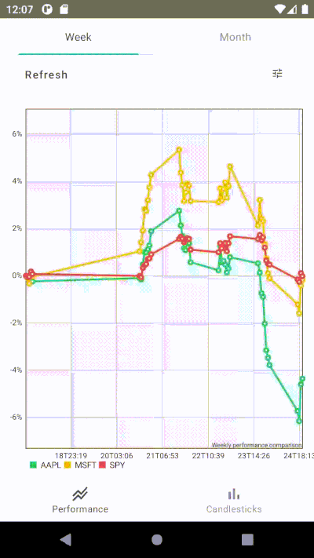

# StocksPerformance 📈

A demo application for android that for the selected timeframe builds financial charts with stock performance calculations using hardcoded data.

## Android development

This demo app attempts to use the latest cutting edge libraries and tools. As a summary:

* Entirely written in [Kotlin](https://kotlinlang.org/).
* UI completely written in [Jetpack Compose](https://developer.android.com/jetpack/compose) (see below).
* Uses [Kotlin Coroutines](https://kotlinlang.org/docs/reference/coroutines/coroutines-guide.html) and [Kotlin Flow API](https://kotlinlang.org/docs/flow.html#flows) throughout.
* Uses many of the [Architecture Components](https://developer.android.com/topic/libraries/architecture/), including: Room, Lifecycle, Navigation.
* Uses [MPAndroidChart](https://github.com/PhilJay/MPAndroidChart/) to show the charts.

## Development setup

The project requires [Android Studio Arctic Fox](https://developer.android.com/studio/preview) release to be able to build the app because the project is written in [Jetpack Compose](https://developer.android.com/jetpack/compose).

## Jetpack Compose
As mentioned above, this app's UI is completely written in [Jetpack Compose](https://developer.android.com/jetpack/compose). Some screens highlighted are:

### Performance chart

[[source](/app/src/main/java/com/rarms/stocks/performance/ui/charts/performance)]

### Candlesticks chart

[[source](/app/src/main/java/com/rarms/stocks/performance/ui/charts/candlesticks)]

## Road map

- Carry out network error modelling.
- Fix time formatting for candlesticks chart.
- Move chart data preparation to background(?).
- Write tests.

## Contributions

If you've found an error in this sample, please file an issue.

Patches are encouraged and may be submitted by forking this project and
submitting a pull request. Since this project is still in its very early stages,
if your change is substantial, please raise an issue first to discuss it.

## License

MIT License

Copyright (c) 2021 Ruslan Urmeev

Permission is hereby granted, free of charge, to any person obtaining a copy
of this software and associated documentation files (the "Software"), to deal
in the Software without restriction, including without limitation the rights
to use, copy, modify, merge, publish, distribute, sublicense, and/or sell
copies of the Software, and to permit persons to whom the Software is
furnished to do so, subject to the following conditions:

The above copyright notice and this permission notice shall be included in all
copies or substantial portions of the Software.

THE SOFTWARE IS PROVIDED "AS IS", WITHOUT WARRANTY OF ANY KIND, EXPRESS OR
IMPLIED, INCLUDING BUT NOT LIMITED TO THE WARRANTIES OF MERCHANTABILITY,
FITNESS FOR A PARTICULAR PURPOSE AND NONINFRINGEMENT. IN NO EVENT SHALL THE
AUTHORS OR COPYRIGHT HOLDERS BE LIABLE FOR ANY CLAIM, DAMAGES OR OTHER
LIABILITY, WHETHER IN AN ACTION OF CONTRACT, TORT OR OTHERWISE, ARISING FROM,
OUT OF OR IN CONNECTION WITH THE SOFTWARE OR THE USE OR OTHER DEALINGS IN THE
SOFTWARE.
